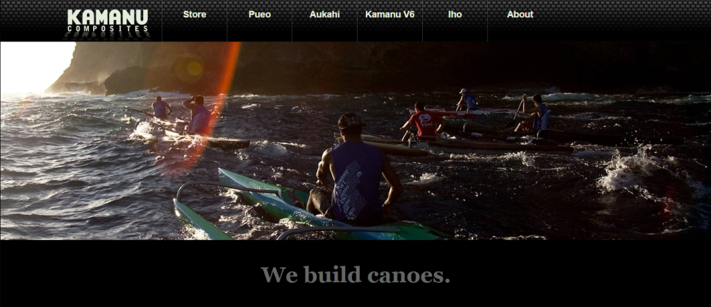
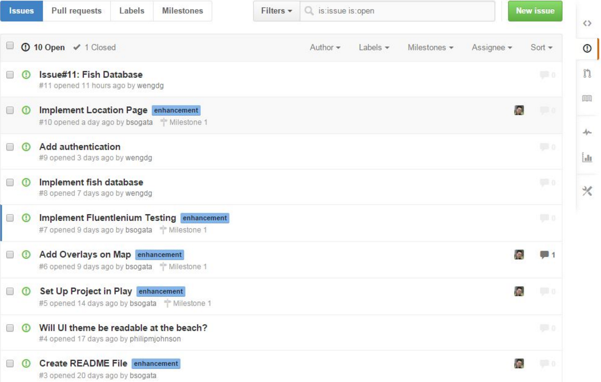

As I begin to prepare material for my ICS 314 sections, I thought it'd be fitting to share my own experience with software engineering under Philip Johnson at UHM.  Although I work with computers quite a bit, I did not have any formal programming experience until after my undergrad years, when I decided that I would jump head first into the ICS Master's  program from a BS in Marine Biology (if interested, <a href="https://wengdg.github.io/essays/essay1.html">here is a little backstory</a>).  I took a year and a half to take the essential prerequisites, and then got admitted.  I was excited and quite confident since I had done well in the prereqs.  The first graduate course within the program that I had officially registered for was ICS 613, or software engineering.  Because I have never taken the undergraduate software engineering courses, I did not quite know what to expect.  It was all good though, because I was ready to create some awesome apps.  Unfortunately, I was ten minutes late for my first day of class.  I didn't think too much of it, since I normally showed up late to my classes, and honestly, who really cares?  Well... Dr. Johnson cared.  And he made it a point to lecture me in front of the other students about being late.  So it was a great start.

One of the aspects of the class that I was originally excited for were the Workout of the Days, or <a href="http://philipmjohnson.org/essays/ase-2017.html">WODs</a>.  These were short, timed programming assignments that were either a pass or fail.  Although difficult, they were an interesting challenge and was beneficial for those with little programming experience outside of coursework.  To prepare for the in-class WODs, Dr. Johnson suggested that we work on the practice ones on our own time, and without watching his solution videos.  And so, I did just that to prepare for the first in-class WOD.  The practice assignments were not difficult, and I completed most of them without too much trouble.  I did fail to complete one in the alloted time, but I was at home so I wasn't under any pressure to go fast.  I felt ready for the real WOD.  And of course, all this buildup probably means that I failed the first class WOD...  Which I did.  It was embarassing for me, as the assignment itself was actually quite simple.  There is a significant difference, however, between working on a practice WOD at home, and working on a live WOD in class, and that difference is in the sweaty palms.  At home, you have opportunities to "cheat" a little because you are much less strict on yourself.  Maybe you have resources opened in another monitor, or perhaps you're timing yourself differently or allowing pauses.  Maybe you'll take a two minute break to rest on your bed in the middle of a WOD, fall asleep, wake up, and go "eh I would have passed it anyways".  Well, you can't do any of that in class.  All you have during the class WODs is your own raw knowledge and resolve, and indeed, it can become quite nerve-wracking.  This will lead to mistakes.  That's not why I failed that first WOD, though.  I failed because I didn't read the instructions clearly, thus not including a minor printout.

Aside from the WODs, the other major component of the coursework was the final project.  As a relative noob to the ICS world, I had to dedicate quite a bit of time adjusting to the workload of the project.  There were several hindrances from the start, with most of the problems stemming from the fact that it was a group project.  Getting used to Github was one of those problems.  Although we had used it extensively in class, sharing a repo with others was strange.  Again, this was mostly due to my own inexperience.  There were many occasions where there was confusion among different versions and branches, and good code being overwritten.  Additionally, distribution of work was a bit messy.  Because I originally proposed <a href="http://reefnexus.github.io/reefnexus/">ReefNexus</a>, I felt responsible for at least organizing the work for the team.  I had a lot of ideas but little experience in leading, so communicating everything was rough.  Needless to say, the less than stellar project management and Github utilization lead to a less than stellar start.  Slowly, however, we gained traction with the Github usage, and the distribution of work began to fall into place itself.  One of the group members, Brandon, who proposed working with the Google Maps API from the start, followed stoicly with the proposition.  Although I had envisioned all of us dividing the map portion, it turned out for the best that one person focused on it to avoid any conflicts.  This freed up my own time to work on the layout of the website, and our other group member, Eric, to work on the database.  All three of us also contributed to the discussion of new ideas and direction for the application.  Each milestone for the project was met with vast improvements in our work management and ReefNexus itself, and in fact, turned out to be quite enjoyable to work on by the end.  

Although I feel awkward now dedicating an entire post to a single course, it's also great to relive it a little as it was one of the more memorable experiences in my ICS career.  The WODs continued to be brutal throughout the course, but it also built quite a bit of character.  By the end of the course, it was just another thing to do, and that is the entire point of the workouts: to become more comfortable with programming on the spot.  There are very little assignments in the current ICS curriculum that tests this aspect.  The project was perhaps the most rewarding part of the course, and I was very satisfied with the final product that me and my team pushed out.  More satisfying, though, was how much I gained from working <u>properly</u> in a group, even if I didn't notice it at the time.  My old blog posts from the course are still pretty cringe to read, though.
