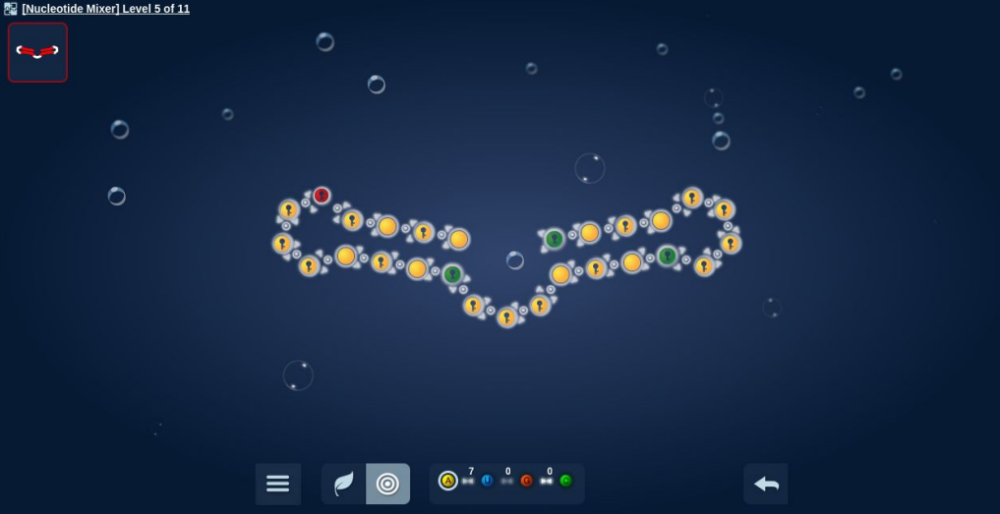

One of my current research topics is the application of crowd-sourcing techniques to a sequence alignment, a fundamental method in bioinformatics.  Sequence alignment is used to find similarity between two genomic or proteomic sequences (DNA, RNA, protein), and from there a relationship may be derived between the two species from which the sequences belong to.  Multiple sequence alignment is the alignment of more than two sequences, and is a very complex problem.  My research specifically focuses on the presentation of sequence alignment as a game, as the method itself has many puzzle-like elements.  By allowing players to work on subproblems of a larger multiple sequence alignment, better solutions may be obtained than what current algorithms can provide.  This collection of crowd-sourced data is known as citizen science, and can be seen as a collaboration between scientists and the general public.  My literature review justifies the application of citizen science to protein sequence alignment, and is the entry point of my research before working on a full-fledged game.  The following is the introduction from my literature review (references also provided):

<h2>1 Introduction</h2>

Sequence alignment is a core technique in bioinformatics that is utilized in numerous applications across biology, including phylogenetic tree reconstruction, protein structure prediction, and functional residue detection [18,20,31].  In its most basic function, sequence alignment is used to find similarity between two genomic or proteomic sequences.  More useful information may be extracted when an entire set of sequences are aligned to each other.  This technique, called a multiple sequence alignment (MSA), makes it possible to reveal regions that are conserved across sequences, and also regions that differ, resulting in variability.  The sum of these observations help form inferences to molecular and phylogenetic relationships, and drives the majority of the aforementioned applications [5].  Due to this, it is critical that MSA techniques remain accurate.  Perhaps just as important is that MSA techniques also remain efficient.  The current high-throughput era has resulted in the exponential growth of sequence outputs to biological databases [10,14].  Although this massive output of data is to the advantage of scientific discovery, it also puts pressure in the development of more optimized algorithms.  MSA is a computationally expensive task, and as a result there is usually a compromise between speed and accuracy [27,31,34,40].  Heuristic methods are used to keep alignments at a reasonable pace, but this also does not guarantee complete accuracy.  Fortunately, a major sector of bioinformatics is dedicated to improving alignment algorithms, and as such, an abundance of open-source alignment tools have been pushed out in the past couple of decades.  These tools usually aim to improve time efficiency while maintaining high accuracy.  Even in the face of these developments, however, many current MSA methods struggle with accurate alignments for all types of test cases [27,31,34,40].

Recently, scientists have begun to look outside their labs for help with complex problems that automation alone cannot fully solve [13].  One such source of aid is from the general public themselves, or crowdsourcing.  Also known as citizen science (CS), in where non-scientists assists scientists with a specific problem, crowdsourcing has long been a viable method in the scientific community [13,43].  Typical CS problems generally fall into categories where a large number of discrete workers would beneficial, including data collection, data analysis, and problem-solving [40].  With the advent of internet technologies, however, interacting with thousands of individuals worldwide is now only a few mouse clicks away.  This has lead to an abundance of online crowdsourcing platforms, where individuals can perform specific tasks in return for some sort of compensation.  In some crowdsourced applications, namely games, the compensation is entertainment.  Termed “games with a purpose”, or GWAPs, these applications aim to attract the public by transforming the task at hand into an entertaining game [43].  In the recent decade, GWAPs have gained traction within the bioinformatics community, with games being developed that requires players to manipulate the shape of proteins, manipulate the shape of RNA molecules, and to also align biological sequences [7,19,26].  Although computers can perform the same type work and to an even faster degree than humans, we still ultimately hold the advantage in pattern recognition and spatial reasoning [4,19].  It may be to the advantage of scientists, then, to harness both the computational power of machines and the natural ingenuity of humans.

This study aims to rationalize the application of CS to the problem of multiple sequence alignment, and how solutions from non-scientists can benefit the problem of such complexity.  Justification will also be shown for the favoring of protein alignments to DNA alignments in citizen science applications.  The majority of applications today that require large-scale MSAs are based on protein sequence analyses [21], and thus it would be more beneficial to focus on developing GWAPs that implements the amino acid alphabet and scoring scheme.  The paper will first review the pairwise sequence alignment procedure, which is important to understand as it forms the underlying framework for MSA.  The MSA procedure will then be reviewed along with a comparison of current MSA methods drawn from recent studies.  For an alignment GWAP to be relevant, it must fulfill some aspect that current methods do not, so such an analysis will be useful.  This will be followed by an overview of modern citizen science applications in bioinformatics, and their impact in the scientific community.  This includes GWAPs that cover protein structure prediction, RNA structure prediction, and sequence alignment.  Section 4 will then go over the justification of applying citizen science to the protein MSA problem.  Disadvantages of CS will also be discussed.  Finally, in Section 5, design suggestions will be provided for future CS alignment projects.

<h2>7 References</h2>

1.	Altschul, Stephen F. et al. “Basic Local Alignment Search Tool.” Journal of Molecular Biology 215.3 (1990): 403–410. CrossRef. Web.

2.	Anderson-Lee, Jeff et al. “Principles for Predicting RNA Secondary Structure Design Difficulty.” Journal of Molecular Biology 428.5, Part A (2016): 748–757. ScienceDirect. Web. Challenges in RNA Structural Modeling and Design.

3.	Barbato, Alessandro et al. “Improving Your Target-Template Alignment with MODalign.” Bioinformatics 28.7 (2012): 1038–1039. academic.oup.com. Web.

4. 	Bininda-Emonds, Olaf. “transAlign: Using Amino Acids to Facilitate the Multiple Alignment of Protein-Coding DNA Sequences.” BMC Bioinformatics 6 (2005): 156. Web.

5. 	Chatzou, Maria et al. “Multiple Sequence Alignment Modeling: Methods and Applications.” Briefings in Bioinformatics 17.6 (2016): 1009–1023. CrossRef. Web.

6. 	Chung, Christina et al. “Serious Games for NP-Hard Problems: Challenges and Insights.” ACM Press, 2016. 29–32. CrossRef. Web. 4 May 2017.

7. 	Cooper, Seth, Firas Khatib, Adrien Treuille, Janos Barbero, Jeehyung Lee, Michael Beenen, Andrew Leaver-Fay, David Baker, Zoran Popović, et al. “Predicting Protein Structures with a Multiplayer Online Game.” Nature 466.7307 (2010): 756–760. PubMed. Web.

8. 	Cooper, Seth, David Baker, et al. “The Challenge of Designing Scientific Discovery Games.” ACM Press, 2010. 40–47. CrossRef. Web. 4 May 2017.

9.	Darwin, Charles. On the Origin of Species by Means of Natural Selection, Or, the Preservation of Favoured Races in the Struggle for Life. London: John Murray, 1859. Print.

10. Daugelaite, Jurate, Aisling O’ Driscoll, and Roy D. Sleator. “An Overview of Multiple Sequence Alignments and Cloud Computing in Bioinformatics.” ISRN Biomathematics 2013 (2013): 1–14. CrossRef. Web.

11.	Eiben, Christopher B. et al. “Increased Diels-Alderase Activity through Backbone Remodeling Guided by Foldit Players.” Nature Biotechnology 30.2 (2012): 190–192. www.nature.com. Web.

12.	Feng, Da-Fei, and Russell F. Doolittle. “[23] Progressive Alignment and Phylogenetic Tree Construction of Protein Sequences.” Methods in Enzymology 183 (1990): 375–387. ScienceDirect. Web.

13. Good, B. M., and A. I. Su. “Crowdsourcing for Bioinformatics.” Bioinformatics 29.16 (2013): 1925–1933. CrossRef. Web.

14. Goodwin, Sara, John D. McPherson, and W. Richard McCombie. “Coming of Age: Ten Years of next-Generation Sequencing Technologies.” Nature Reviews Genetics 17.6 (2016): 333–351. CrossRef. Web.

15. Henikoff, S., and J. G. Henikoff. “Amino Acid Substitution Matrices from Protein Blocks.” Proceedings of the National Academy of Sciences 89.22 (1992): 10915–10919. Print.

16. Hess, Martin et al. “Serious Games for Solving Protein Sequence Alignments - Combining Citizen Science and Gaming.” Games for Training, Education, Health and Sports. Ed. Stefan Göbel and Josef Wiemeyer. Vol. 8395. Cham: Springer International Publishing, 2014. 175–185. CrossRef. Web. 4 May 2017.

17. Hug, Laura A. et al. “A New View of the Tree of Life.” Nature Microbiology 1.5 (2016): 16048. CrossRef. Web.

18. Iwabe, N. et al. “Evolutionary Relationship of Archaebacteria, Eubacteria, and Eukaryotes Inferred from Phylogenetic Trees of Duplicated Genes.” Proceedings of the National Academy of Sciences 86.23 (1989): 9355–9359. Print.

19. Kawrykow, Alexander et al. “Phylo: A Citizen Science Approach for Improving Multiple Sequence Alignment.” Ed. Pawel Michalak. PLoS ONE 7.3 (2012): e31362. CrossRef. Web.

20. Kececioglu, John, Eagu Kim, and Travis Wheeler. “Aligning Protein Sequences with Predicted Secondary Structure.” Journal of Computational Biology: A Journal of Computational Molecular Cell Biology 17.3 (2010): 561–580. PubMed. Web.

21. Kemena, C., and C. Notredame. “Upcoming Challenges for Multiple Sequence Alignment Methods in the High-Throughput Era.” Bioinformatics 25.19 (2009): 2455–2465. CrossRef. Web.

22.	Khatib, Firas et al. “Crystal Structure of a Monomeric Retroviral Protease Solved by Protein Folding Game Players.” Nature Structural & Molecular Biology 18.10 (2011): 1175–1177. www.nature.com. Web.

23. Kleka, Pawel, and Pawel Lupkowski. “Gamifying Science – the Issue of Data Validation.” Homo Ludens 6 (2014): n. pag. Print.

24.	Kryshtafovych, Andriy, and Krzysztof Fidelis. “Protein Structure Prediction and Model Quality Assessment.” Drug discovery today 14.7–8 (2009): 386–393. PubMed Central. Web.

25.	Kwak, Daniel et al. “Open-Phylo: A Customizable Crowd-Computing Platform for Multiple Sequence Alignment.” Genome Biology 14 (2013): R116. BioMed Central. Web.

26. Lee, Jeehyung et al. “RNA Design Rules from a Massive Open Laboratory.” Proceedings of the National Academy of Sciences 111.6 (2014): 2122–2127. CrossRef. Web.

27. Manzoor, Umar, Sarosh Shahid, and Bassam Zafar. “A Comparative Analysis of Multiple Sequence Alignments for Biological Data.” Ed. Feng Liu et al. Bio-Medical Materials and Engineering 26.s1 (2015): S1781–S1789. CrossRef. Web.

28. Melvin, Paul Guy et al. “Games That Enlist Collective Intelligence to Solve Complex Scientific Problems.” Journal of Microbiology & Biology Education 17.1 (2016): 133–136. CrossRef. Web.

29. Morrison, David A. “Is Sequence Alignment an Art or a Science?” Systematic Botany 40.1 (2015): 14–26. CrossRef. Web.

30. Ovchinnikov, Sergey et al. “Protein Structure Determination Using Metagenome Sequence Data.” Science 355.6322 (2017): 294–298. CrossRef. Web.

31. Pais, Fabiano Sviatopolk-Mirsky et al. “Assessing the Efficiency of Multiple Sequence Alignment Programs.” Algorithms for Molecular Biology 9.1 (2014): 4. CrossRef. Web.

32. Pearson, William R. “An Introduction to Sequence Similarity (‘Homology’) Searching.” Current protocols in bioinformatics / editoral board, Andreas D. Baxevanis ... [et al.] 0 3 (2013): n. pag. PubMed Central. Web. 9 May 2017.

33. Perry, Daniel et al. “Diverse Player Experiences in the Design of Science Games for Bioinformatics Learning.” ACM Press, 2013. 104–109. CrossRef. Web. 4 May 2017.

34.	Pervez et al. “Evaluating the Accuracy and Efficiency of Multiple Sequence Alignment Methods.” Evolutionary Bioinformatics (2014): 205. CrossRef. Web.

35. Radivojac, Predrag et al. “A Large-Scale Evaluation of Computational Protein Function Prediction.” Nature Methods 10.3 (2013): 221–227. www.nature.com. Web.

36.	Rallapalli, Ghanasyam et al. “Lessons from Fraxinus, a Crowd-Sourced Citizen Science Game in Genomics.” eLife 4 (2015): n. pag. CrossRef. Web. 3 May 2017.

37. Sabou, Marta et al. “Games with a Purpose or Mechanised Labour?: A Comparative Study.” ACM Press, 2013. 1–8. CrossRef. Web. 4 May 2017.

38. Sullivan, Delaney. “Leveraging Video Game Playing to Improve Computational Biology Research.” Intersect 10.2 n. pag. Print.

39. Tan, Ge et al. “Current Methods for Automated Filtering of Multiple Sequence Alignments Frequently Worsen Single-Gene Phylogenetic Inference.” Systematic Biology 64.5 (2015): 778–791. CrossRef. Web.

40. Thompson, Julie D. et al. “A Comprehensive Benchmark Study of Multiple Sequence Alignment Methods: Current Challenges and Future Perspectives.” Ed. Jonathan Badger. PLoS ONE 6.3 (2011): e18093. CrossRef. Web.

41. Tinati, Ramine et al. “Designing for Citizen Data Analysis: A Cross-Sectional Case Study of a Multi-Domain Citizen Science Platform.” ACM Press, 2015. 4069–4078. CrossRef. Web. 4 May 2017.

42.	Tuite, Kathleen. “GWAPs: Games with a Problem.” N.p., 2014. Print.

43.	Von Ahn, Luis. “Human Computation.” Carnegie Mellon University, 2005. Print.

44. Waldispühl, Jérôme, Arthur Kam, and Paul P. Gardner. “Crowdsourcing RNA Structural Alignments with an Online Computer Game.” Pacific Symposium on Biocomputing. Pacific Symposium on Biocomputing (2015): 330–341. Print.

45.	Wang, Lusheng, and Tao Jiang. “On the Complexity of Multiple Sequence Alignment.” Journal of Computational Biology 1.4 (1994): 337–348. CrossRef. Web.

46.	Wernersson, R. “RevTrans: Multiple Alignment of Coding DNA from Aligned Amino Acid Sequences.” Nucleic Acids Research 31.13 (2003): 3537–3539. CrossRef. Web.

47.	Yan, Renxiang et al. “A Comparative Assessment and Analysis of 20 Representative Sequence Alignment Methods for Protein Structure Prediction.” Scientific Reports 3.1 (2013): n. pag. CrossRef. Web. 7 May 2017.
