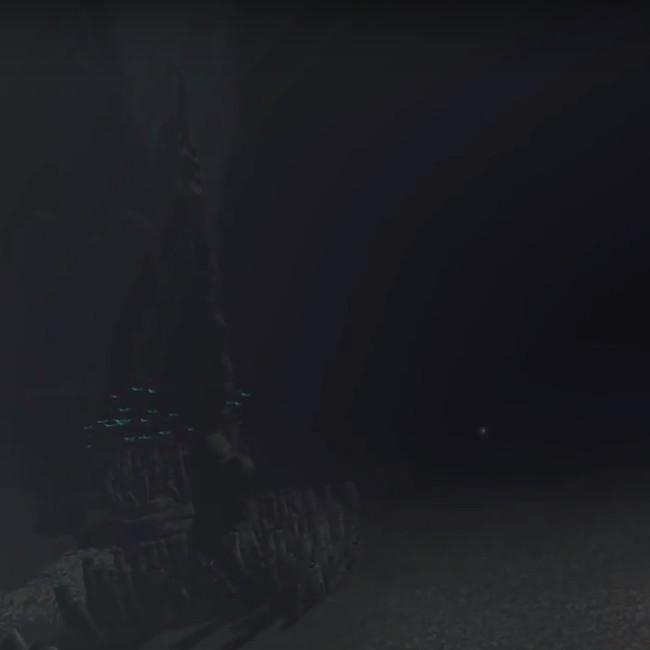

layout: project
type: project
image: images/deep-sea.jpg
title: Citizen Science in Bioinformatics
permalink: projects/citscibio
date: 2017
labels:
  - Serious Games
  - Citizen Science
  - Sequence Alignment
  - Bioinformatics
summary: Justifying the case for citizen science in protein multiple sequence alignment.  A literature review.
---

Deep Sea Exploration is a virtual reality game developed as the final project for an ICS 691: Special Topics course (instructed by Jason Leigh).  The game immerses the player into the ocean abyss, manning a submersible to explore deep-sea communities.  The atmosphere of the game was the main focus during development as it was important to give players a sense of presence and not take them out of the virtual reality experience.  This was achieved by forgoing any music and instead using ambient sound and relying on dim lighting to portray the benthic world.  This game was developed with Unity to be played on the HTC Vive.

Demo of the gameplay can be found <a href="https://www.youtube.com/watch?v=XUS7eXnGGBo">here</a>
