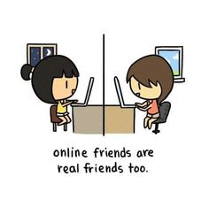

As the Internet continues to consume our daily lives, it is only natural that relationships are formed online.  Although the term "friend" may be defined differently amongst individuals, classical definitions such as that attributed by Aristotle restrict true friends to face-to-face interactions.  This definition continues to evolve, though, and the criteria for friendship has changed considerably throughout time and technology.  This study on online friendship was conducted as part of the final project for ICS 668: Social Informatics.  A survey was created and posted on Amazon Turk for individuals to answer, and consisted of questions that concerned the relationship between offline and online friendships.  The link to the survey can be found <a href="https://www.surveymonkey.com/r/BG6BXYY">here</a>.  The introduction to the paper is provided below, along with references.

<h3>2 Introduction</h3>

There is little doubt today that the Internet has brought
upon an environment that seems to starkly contrasts what
the offline world has to offer. As humans naturally tend to be
more social creatures, it was inevitable that the increasingly
ease of access to the web would result in the presence of massive
online communities. These communities include social
media giants such as FaceBook and Instagram, discussion
forums centered around almost any subject one could think
of, and massively multiplayer online video games where hundreds
of players could exist together on a single server. It
was also inevitable, then, that these social components of
the web would allow for relationships to start. Persistent
online communities and chat systems allowed people to interact
effortlessly with each other on common grounds, and
friendships would grow. Today, it is not uncommon for an
individual to have friends from which they met and know
exclusively online. There is still debate, however, whether
fostering online friendships is worthwhile, and whether or
not the definition of friendship should still be bound to of-
fline values in a society where our online presence is becoming
almost permanent. Indeed, online and offline friends can
provide very different aspects to a friendship, and as such
they are often perceived independently of each other. But
are these differences significant enough for online and offline
friendships to still be considered as separate entities in today’s
digital landscape? This may be a more meaningful
question to explore, rather than arguing about what constitutes
as genuine friendship. This emperical study aims to
bring upon insight to that question by turning to individuals
who are already active in online communities and asking
them if they feel comfortable with describing online friends
as on the same level of offline friends.

<h3>2.1 Current Stance on Online Friendship</h3>

The value of online friendships have been a major area
of research over the past couple of decades. For example,
numerous studies have been dedicated to why people look
to the web for companionship, and the social aspects that
keep them invested in such a commitment [8,9,10]. Perhaps
one of the more important, and controversial issues, however,
is whether or not online friendships can be considered
genuine. A set of guidelines from which friendships are often
compared to is that defined by Aristotle. There are three
types of friendships from which Aristotle references, including
friendship based on utility, friendship based on pleasure,
and friendship based on goodness. The latter guideline is the
definition most studies refer to when looking to judge online
friendships [3,4,6]. According to Aristotle, this definition is
superior to the other two because it is based on the virtue of
two people, and their admiration for each other. In Fr¨oding
and Peterson’s study of virtual friendships, it is also stated
that this definition of friendship is maintained through three
conditions: that the friendship is mutually recognized, that
the friends involved spend time together, and that the admiration
for each other is based on the virtues recognized in
each other. It is argued in their paper that these conditions
are difficult to fulfill online when individuals are allowed to
be selective of what they reveal about themselves. In addition,
people that spend time together physically are able to
experience the same situations and thus virtues are able to
be recognized in each other. This argument is a focal point
in a study by Cocking and Matthews, and also in a study by
McFall [2,7]. Also based on Aristotelian principles, McFall
proposes that single-filter communication, in which a person
does not need to filter their experiences as they are physically
shared amongst others, is not possible in a text-based
setting.

On the other side of the spectrum are the counterviews to
Aristotle’s definition of friendship. In an article by Kaliarnta,
she argues that by viewing offline friendship as the “natural”
way of progression, we are limiting ourselves to possibilities
of higher levels of friendship in the online environment [6,9].
Kaliarnta recognizes that people can be selective about what
they reveal, but at the same time, they can also choose to
be more open about themselves without any obligations. In
a study by Henderson and Gilding, they found that online
communication sometimes surpassed the level of affection
and emotion of parallel face-to-face communication [5]. Online,
you are seldom judged on your background and appearance.
This pseudonymity is a driving point for many people
to keep online relations [12]. Individuals who seek companionship
online or are able to make online friends were often
found to be introverted or socially withdrawn in the offline
world [8]. At the same time, those who were willing to reveal
more personal information were rewarded with heightened
self-discovery [5]. Kaliarnta also mentions that while there
is still the lack of physical interaction, single-filtering is very
possible through mediums such as video games, which allow
for individuals to experience unique situations together. Elder
also provides similar counterarguments to Kaliarnta, but
instead of countering Aristotle’s conditions of friendship, he
provides aspects of online friendship which actually meets
those conditions [4].

<h3>6 References</h3>
[1]Buhrmester, M, Kwang, T, Gosling, S. 2011. Amazon’s
Mechanical Turk: A new source of inexpensive, yet highquality
data? Perspectives on Psychological Science 6: 3-5.

[2]Cocking, D, Matthews, S. 2000. Unreal friends. Ethics
Inf Technol 2: 223-231.

[3]Fr¨oding, B, Peterson, M. 2012. Why virtual friendship
is no genuine friendship. Ethics Inf Technol 14: 201-207.

[4]Elder, A. 2014. Excellent online friendships: an Aristotelian
defense of social media.

[5]Henderson, S, Gilding, M. 2004. ’I’ve never clicked this
much with anyone in my life’: Trust and hyperpersonal communication
in online friendships. New Media & Society 6:
487-506.

[6]Kaliarnta, S. 2016. Using Aristotle’s theory of friendship
to classify online friendships: a critical overview. Ethics
Inf Technol: 1-15.

[7]McFall, M. 2012. Real character-friends: Aristotelian
friendship, living together, and technology. Ethics Inf Technol
14: 221-230.

[8]McKenna, K, Green, A, Gleason, M. 2002. Relationship
formation on the Internet: What’s the big attraction?
Journal of Social Issues 58: 9-31.

[9]Mesch, G, Talmud, I. 2006. Online friendship formation,
communication channels, and social closeness. International
Journal of Internet Science 1: 29-44.

[10]Ridings, C, Gefen, D. 2004. Virtual community attraction:
Why people hang out online. Journal of ComputerMediated
Communication 10.

[11]Smahel, D, Brown, B.D, Blinka, L. 2012. Associations
between online friendship and Internet addiction among adolescents
and emerging adults. American Psychological Association
48: 381-388.

[12]Søraker, J. 2012. How shall I compare three? Comparing
the prudential value of actual and virtual friendship.
Ethics Inf Technol 14: 209-2019.

[13]Zinoviev, D, Duong, V. 2009. Toward understanding
friendship in online social networks. International Journal
of Technology, Knowledge, and Society.
